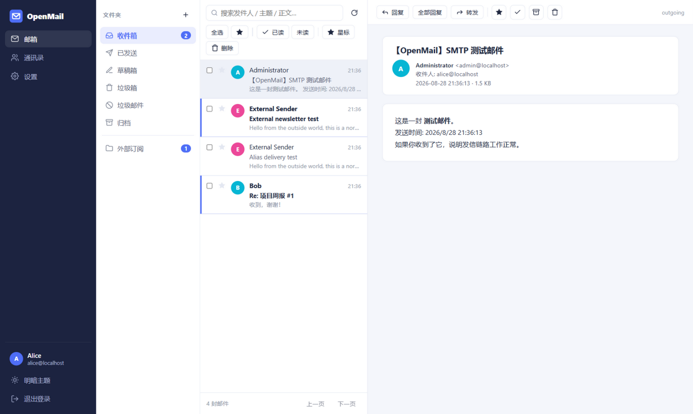
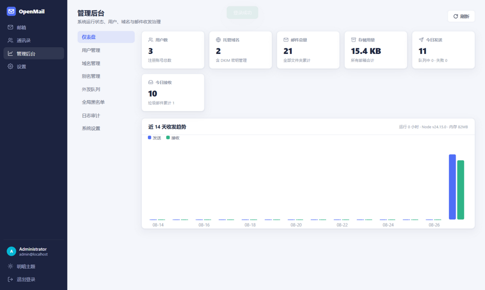
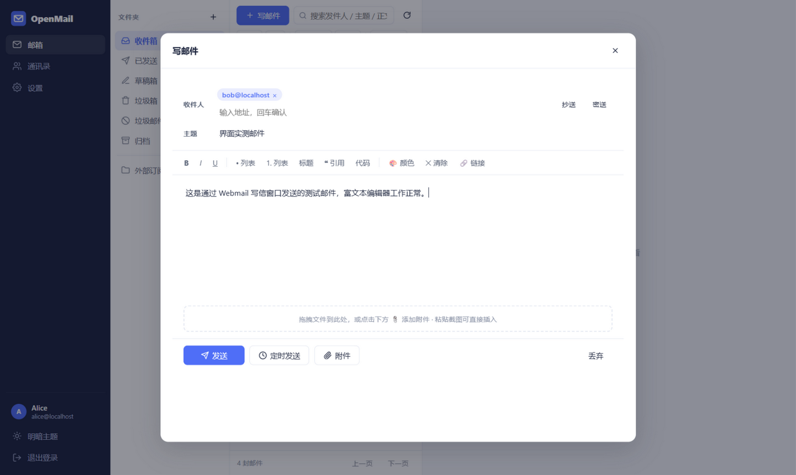
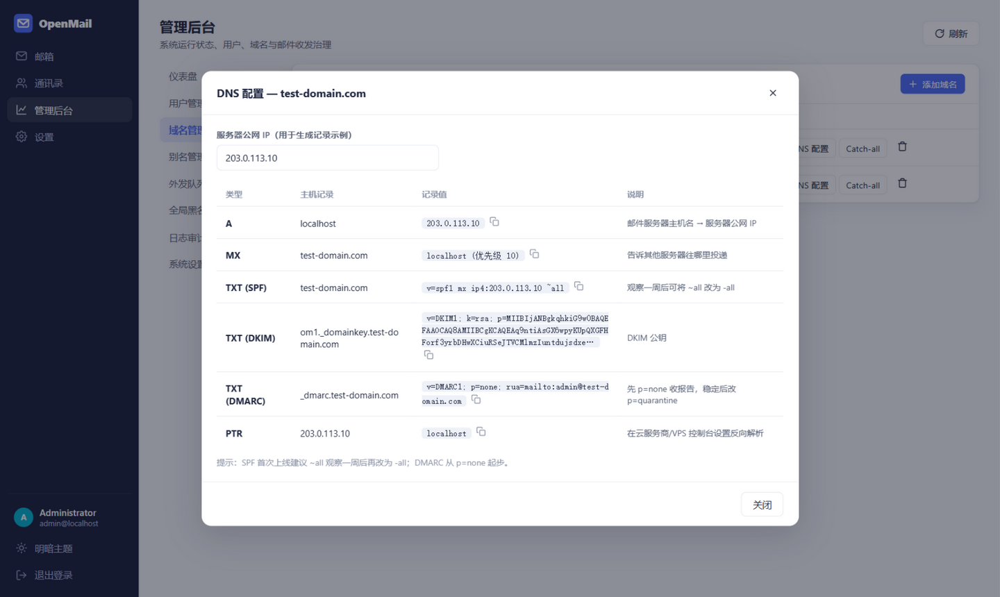
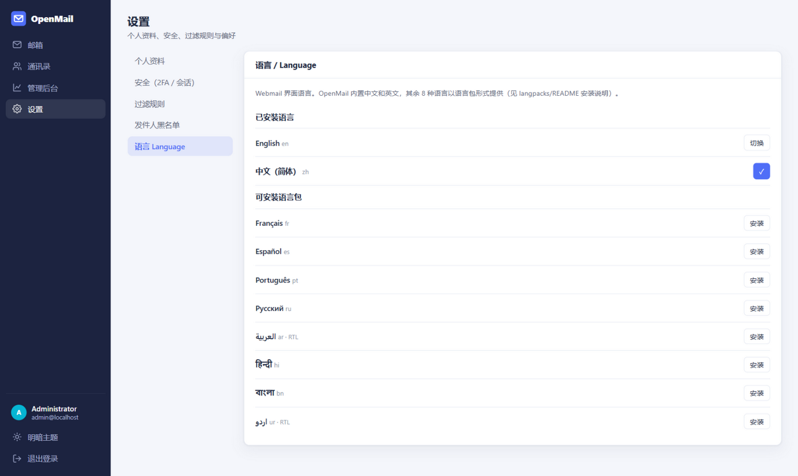
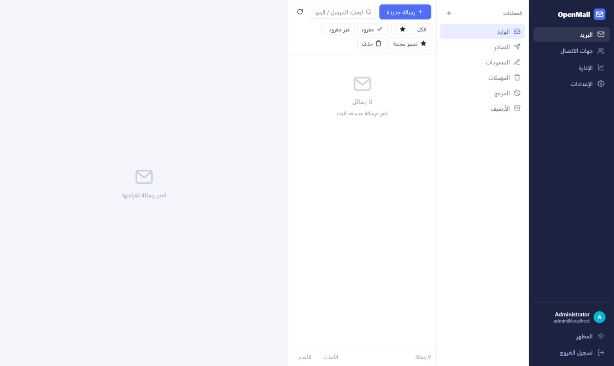

# OpenMail

**A self-hosted, open-source mail server suite in a single Node.js process** — full-stack email with SMTP / IMAP / POP3, a modern three-pane webmail, an admin dashboard, multi-tenancy, DKIM, anti-spam and 2FA. Zero native dependencies, one SQLite file, up and running in minutes.

<p>
  
  
</p>
<p>
  
  
</p>

[简体中文文档](README.zh-CN.md)

---

## Why OpenMail

Most self-hosted mail stacks glue together a dozen daemons (Postfix, Dovecot, Rspamd, Redis, MySQL…). OpenMail is a **deliberately simple, single-binary-style mail platform** written entirely in JavaScript:

- **One process** runs SMTP (MX + Submission + SMTPS), IMAP, IMAPS, POP3, POP3S, the HTTP API and the webmail UI.
- **Zero native modules** — `node:sqlite` (built into Node.js 22+), pure-JS crypto. Installs in seconds on Windows, Linux, macOS, ARM64.
- **Real protocols** — Thunderbird / Apple Mail / Outlook can connect via IMAP/SMTP out of the box.
- **Sane defaults** — DKIM keys auto-generated per domain, DNS records rendered in the admin UI, spam scoring built in.

It is ideal for personal mail, small teams, homelabs, and as a readable codebase to learn how email actually works.

## Feature matrix

### Mail
| Feature | Details |
| --- | --- |
| Send & receive | Inbound SMTP (port 25 MX), authenticated Submission (587), implicit-TLS SMTPS (465); multiple accounts per instance |
| Operations | Read / write / reply / reply-all / forward, batch multi-select move, delete, star, mark read |
| Drafts & scheduling | Server-side autosaving drafts every 12 s, scheduled send with a delivery scheduler |
| Attachments | Upload, download, preview; drag & drop; **paste screenshots directly into the composer**; inline images via CID |
| Search | Full-text across sender, recipients, subject, body; per-folder or global |
| Organization | Folders (system + custom), stars, unread filters, **drag & drop messages between folders** |
| Threading | Conversations grouped by `References` / `In-Reply-To` / normalized subject |
| Hygiene | One-click archive of read inbox mail, empty trash / junk |
| **AI assistant** | Bring your own **OpenAI-compatible API** (Base URL + model + key, AES-encrypted server-side): AI **draft writing** with tone control, **translate** emails to 12 languages, **analyze** mail (summary / key points / action items / reply hint) |
| **Email templates** | Save recurring mail as templates, **import HTML templates** (.html file or paste) or **generate them with AI**; one-click insert in the composer |

### Contacts
Add / edit / delete, groups, search, **vCard & CSV import/export**, recipient autocomplete from contacts + directory, compose from contact.

### Accounts & security
| Feature | Details |
| --- | --- |
| Auth | Email + password (bcrypt), optional open registration with admin code |
| 2FA | TOTP (RFC 6238) with QR code enrollment — Google Authenticator compatible |
| Sessions | Multi-device sessions list, per-session and bulk revocation, configurable TTL |
| RBAC | `admin` / `user` / `temp` roles enforced server-side on every route |
| Audit log | Logins, failed logins, sends, admin actions, deliveries — all recorded with IP |

### Domains & multi-tenancy
Multiple domains per instance · per-mailbox storage quotas · aliases with forwarding · **Catch-all per domain** · automatic 2048-bit DKIM key generation with copy-paste DNS records.

### Admin dashboard
Live stats & 14-day send/receive chart · user CRUD / ban / quota / password reset · domain & DKIM management · alias manager · outbound queue inspector · global blacklist · audit log browser · SMTP test · one-click SQLite backup.

### Anti-spam & authentication
- Inbound authentication via **SPF, DKIM and DMARC** verification (`mailauth`)
- Rule-based **spam scoring** (auth failures, keywords, HELO checks…) → auto junk folder, optional SMTP-level rejection
- Outbound mail is **DKIM-signed** automatically using each domain's key
- Per-user and global sender blacklists
- Rate limiting per IP on all SMTP ports

### Protocols
| Protocol | Dev port | Production port | Purpose |
| --- | --- | --- | --- |
| SMTP (MX) | 2525 | **25** | Server-to-server delivery |
| Submission | 2587 | **587** | User sending with SASL auth (STARTTLS) |
| SMTPS | 2546 | **465** | Implicit TLS sending |
| IMAP | 1143 | **143** | Mail pull |
| IMAPS | 1993 | **993** | Implicit TLS mail pull |
| POP3 | 1110 | **110** | Mail download |
| POP3S | 1995 | **995** | Implicit TLS download |
| HTTP | 3000 | reverse-proxy 443 | Webmail / admin / REST API |

> The IMAP/POP3 servers are intentionally minimal (LOGIN, LIST, SELECT, FETCH, STORE, SEARCH, APPEND, IDLE, MOVE…) — enough for everyday client use, not a full RFC 3501 implementation.

## Installation

OpenMail ships **four install paths** — pick one:

| Method | Command / Entry | Best for |
| --- | --- | --- |
| **One-click script** | `curl -fsSL https://raw.githubusercontent.com/chenyuwebwawa/OpenMail/main/install.sh \| bash` | Fresh Linux VPS (installs Node 22, source, `.env`, systemd, language packs) |
| **Docker** | `docker compose up -d` (or one-liner below) | Any server with Docker / 1Panel |
| **Manual server** | `git clone && npm install && npm start` | Development, Windows (see `start-windows.bat`), custom setups |
| **Hosting panels** | BT Panel (宝塔) guide · 1Panel guide | Existing panel-managed servers |

### 1. One-click (Linux server)

```bash
# Interactive: prompts for domain, generates .env, registers a systemd service,
# installs all 10 UI language packs and prints the admin password.
curl -fsSL https://raw.githubusercontent.com/chenyuwebwawa/OpenMail/main/install.sh | bash

# Behind a network that blocks raw.githubusercontent (e.g. mainland China)? Any of:
curl -fsSL https://cdn.jsdelivr.net/gh/chenyuwebwawa/OpenMail@main/install.sh | bash
git clone https://github.com/chenyuwebwawa/OpenMail.git /opt/openmail && cd /opt/openmail && bash install.sh

# Non-interactive with options:
bash install.sh --domain example.com --standard-ports --dir /opt/openmail
```

Flags: `--domain` (mail domain), `--standard-ports` (use 25/587/… instead of dev ports), `--port` (HTTP), `--dir` (install dir). The server runs as a non-root user via systemd (`systemctl status openmail`).

### 2. Docker

```bash
git clone https://github.com/chenyuwebwawa/OpenMail.git && cd OpenMail
cp .env.example .env      # set domain / relay / TLS
docker compose up -d
```

Or a single run (all standard ports + data persisted):

```bash
docker run -d --name openmail --restart unless-stopped \
  -p 3000:3000 -p 25:25 -p 587:587 -p 465:465 \
  -p 143:143 -p 993:993 -p 110:110 -p 995:995 \
  -v openmail-data:/app/data -v openmail-files:/app/files \
  -e OM_PRIMARY_DOMAIN=example.com -e OM_BASE_URL=https://mail.example.com \
  chenyuwebwawa/openmail:latest
```

### 3. Manual

**Requirements:** Node.js ≥ 22.5 (no native build tools needed).

```bash
git clone https://github.com/chenyuwebwawa/OpenMail.git
cd OpenMail
npm install
npm start
```

First launch prints the auto-created admin credentials and writes them to `data/admin-credentials.txt`. On Windows, run `start-windows.bat` for a double-click launcher.

### 4. Hosting panels

- **BT Panel (宝塔面板) — [docs/panels/BAOTA.md](docs/panels/BAOTA.md)**: full walkthrough including the **宝塔邮局 (BT Mail plugin) adaptation** — auto-detects port conflicts with Postfix/Dovecot, can take over mail services or co-exist on dev ports, reverse-proxy site setup, SSL reuse, and migration steps from BT Mail to OpenMail. One-shot adapter script: `scripts/baota-adapt.sh`.
- **1Panel — [docs/panels/1PANEL.md](docs/panels/1PANEL.md)**: Docker-Compose orchestration, OpenResty reverse-proxy site, ACME certificates and firewall rules.

Both panel guides cover **domain + website access**: DNS records → panel site → reverse proxy → HTTPS → mail ports in the panel firewall and cloud security group.

### Production checklist

1. **DNS** — add A, MX, SPF, DKIM, DMARC records (the admin UI renders them for you; details in [docs/DNS-Guide.md](docs/DNS-Guide.md)).
2. **TLS** — point `OM_TLS_CERT` / `OM_TLS_KEY` at a Let's Encrypt certificate (or terminate TLS at Nginx/Caddy). Self-signed certs are generated automatically for development.
3. **Outbound relay** — most clouds block outbound port 25. Configure `OM_RELAY_*` to route external mail through an upstream smarthost, or use a provider with port 25 open.
4. **rDNS (PTR)** — set a reverse DNS record on your server IP pointing to your mail hostname.
5. **Backups** — download SQLite snapshots from the admin UI and back up `files/`; see [docs/DEPLOYMENT.md](docs/DEPLOYMENT.md).

## Interface languages (10)

The webmail and admin console ship with **English and 简体中文** built in, plus **8 installable language packs** (provided as separate content in [`langpacks/`](langpacks/README.md)):

🇬🇧 English · 🇨🇳 简体中文 · 🇫🇷 Français · 🇪🇸 Español · 🇵🇹 Português · 🇷🇺 Русский · 🇸🇦 العربية · 🇮🇳 हिन्दी · 🇧🇩 বাংলা · 🇵🇰 اردو

Arabic and Urdu render the whole UI **right-to-left** automatically. Switch anytime in **Settings → Language**.

<p>
  
  
</p>

Install packs (any one of):

```bash
node scripts/install-langpacks.mjs --all        # CLI: install every pack
node scripts/install-langpacks.mjs fr ar ur     # CLI: specific packs
npm run langpacks                               # show status
```

or in the admin web UI (Settings → Language → Install), or by copying `langpacks/<code>.json` → `public/locales/`. Missing keys fall back to English; see [langpacks/README.md](langpacks/README.md) to write your own pack.

## Configuration

Everything is configured via environment variables (or a `.env` file) — see [.env.example](.env.example). Highlights:

| Variable | Default | Description |
| --- | --- | --- |
| `OM_PRIMARY_DOMAIN` | `localhost` | Domain created on first boot (with DKIM keys) |
| `OM_BASE_URL` | `http://localhost:3000` | Public URL, used in reset links |
| `OM_SECRET` | random | Session/secret key — **set this in production** |
| `OM_REGISTRATION` | `true` | Allow self-service registration |
| `OM_RELAY_HOST/PORT/USER/PASS` | – | Upstream SMTP relay for outbound mail |
| `OM_TLS_CERT` / `OM_TLS_KEY` | – | PEM certificate for STARTTLS / implicit TLS |
| `OM_ANTISPAM`, `OM_SPAM_SCORE` | `true`, `5` | Junk threshold |

CLI maintenance tool:

```bash
node server/setup.js                  # show help
node server/setup.js reset-admin admin@example.com NewPass123
node server/setup.js add-domain example.org
node server/setup.js list-users
```

## Architecture

```
┌────────────────────────── one Node.js process ──────────────────────────┐
│  HTTP :3000          SMTP :25        Submission :587/465   IMAP :143/993│
│  ┌───────────┐      ┌─────────┐     ┌────────────┐       ┌──────────┐   │
│  │ Webmail   │      │ MX pipe │     │ SASL auth  │       │ Minimal  │   │
│  │ Admin UI  │      │ ▼       │     │ ▼          │       │ IMAP/POP3│   │
│  │ REST API  │      │ mailauth(SPF/DKIM/DMARC) + spam score          │   │
│  └─────┬─────┘      └────┬────┘     └─────┬──────┘       └────┬─────┘   │
│        │                 └───────┬────────┘                   │         │
│        ▼                         ▼                            ▼         │
│  ┌──────────────────────────────────────────────────────────────────┐  │
│  │                mailstore (folders, threads, quota, filters)      │  │
│  ├──────────────────────────────────────────────────────────────────┤  │
│  │   node:sqlite (WAL)             files/ attachments (per-user)    │  │
│  └──────────────────────────────────────────────────────────────────┘  │
│  scheduler: scheduled send · outbound queue retry · bounce notices     │
└─────────────────────────────────────────────────────────────────────────┘
```

```
openmail/
├── install.sh              # one-click installer (Node 22 + systemd + langpacks)
├── start-windows.bat       # Windows double-click launcher
├── server/
│   ├── index.js            # entry: HTTP + all services + first-run init
│   ├── smtp.js             # MX / Submission / SMTPS servers
│   ├── imap.js             # minimal IMAP4rev1 server
│   ├── pop3.js             # POP3/POP3S server
│   ├── db.js               # node:sqlite schema + helpers
│   ├── config.js           # env config
│   ├── setup.js            # CLI maintenance tool
│   ├── util/               # TOTP, DKIM keys, TLS, sessions, RBAC
│   ├── mail/               # mailstore, delivery pipeline, outbound, scheduler
│   └── routes/             # auth / mail / contacts / settings / admin / langs APIs
├── public/                 # webmail + admin SPA (vanilla ES modules, no build)
│   ├── js/i18n.js          # i18n runtime (10 languages, RTL aware)
│   └── locales/            # installed language files (en + zh built in)
├── langpacks/              # extra language packs + installer manifest (8 languages)
├── scripts/
│   ├── install-langpacks.mjs
│   └── baota-adapt.sh      # BT Panel (宝塔) adapter incl. BT Mail plugin handling
├── tests/e2e.mjs           # 98-check end-to-end suite (API, SMTP, IMAP, POP3, i18n, AI…)
├── docs/                   # DNS guide, deployment guide, panel guides, screenshots
├── Dockerfile · docker-compose.yml · .env.example
```

> Open `http://localhost:3000/` for the interactive product site; the webmail lives at `/app/`.

**Stack:** Express 5 · nodemailer (MIME/DKIM) · smtp-server · mailparser · mailauth (SPF/DKIM/DMARC) · bcryptjs · `node:sqlite`. Frontend is a dependency-free vanilla-JS SPA with light/dark themes.

## Comparison with other self-hosted solutions

| Solution | Style | Best for | Resources |
| --- | --- | --- | --- |
| **OpenMail** | Single Node.js process, batteries included | Personal / small teams, learning, fast deploys | 512 MB RAM |
| mailcow | Docker full stack, most complete | SMEs wanting everything | 6 GB RAM + 20 GB disk |
| Mailu | Lightweight Docker | Resource-constrained setups | 1–3 GB RAM |
| iRedMail | Traditional installer | Bare-metal preference | 2 GB+ RAM |
| Modoboa | Panel-centric, modular | Mail hosting providers | 2 GB+ RAM |
| Stalwart | Rust, all-in-one, JMAP | Performance-focused | low (512 MB) |
| Mox / Maddy | Go, minimal ops | Personal, enthusiasts | 512 MB– |
| Postfix+Dovecot+Roundcube | Classic combo | Deep customization | à la carte |

## Hardware & network requirements

| Tier | CPU | RAM | Disk |
| --- | --- | --- | --- |
| Personal (< 10 users) | 1 GHz dual-core | 512 MB – 1 GB | 20 GB SSD |
| Team (10–50 users) | 2–4 cores | 2 GB | 100 GB+ SSD |

Network: a static public IPv4, outbound port 25 (or a relay), reverse DNS (PTR) on your IP, firewall limited to the mail ports. Mainland-China cloud providers usually block outbound 25 — use `OM_RELAY_*` or an overseas VPS.

## Development & testing

```bash
npm test        # 77-check e2e suite against a running server (ports 3000/2525/2587/1143/1110)
npm run dev     # node --watch auto-restart
```

The suite covers registration/login, internal & scheduled sending, attachments, external delivery over raw SMTP, SASL submission, IMAP (fetch/store/search/append/list), POP3, folders, filters, blacklists, contacts import/export, 2FA, and every admin API including DKIM/DNS records.

## Security model & known limitations

- Passwords bcrypt-hashed; sessions are random 256-bit tokens stored hashed; cookies are HttpOnly/SameSite.
- Mail HTML is sanitized (script/style/iframes/event handlers stripped) and links get `rel=noopener`.
- SMTP open-relay protection: port 25 only accepts recipients on hosted domains; Submission requires auth.
- **Known limitations** (roadmap): IMAP is minimal (no CONDSTORE/QRESYNC), no JMAP yet, anti-spam is rule-based rather than Bayesian, no built-in CalDAV/CardDAV, per-message quota accounting is approximate on shared attachments.
- This project ships real mail-server functionality — run it on a properly configured host with TLS, and keep backups.

## License

[MIT](LICENSE) — contributions welcome!
